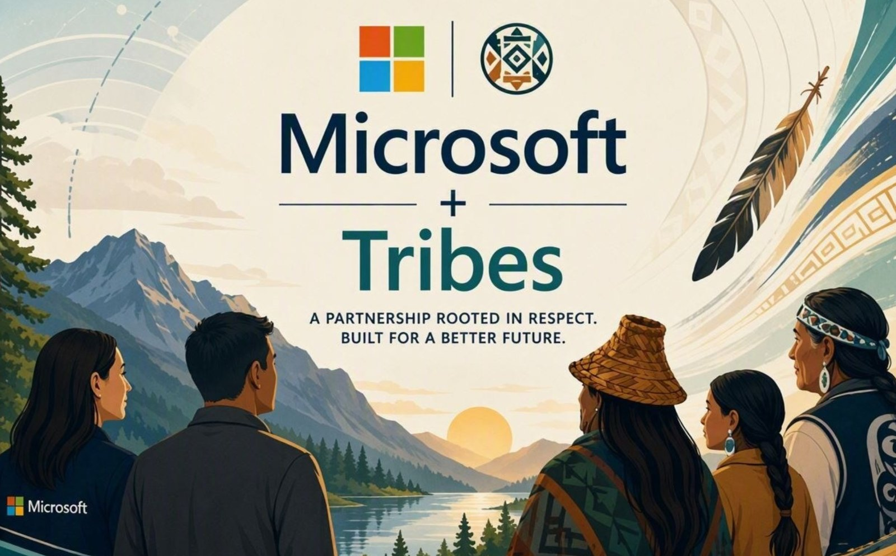

  

# MicrosoftTribalNations — Copilot Agent Gallery

A collection of Microsoft 365 Copilot agent instructions, packaged so they are easy to browse and paste into **Copilot Agent Builder**.

> 🌐 **Companion site:** [**Microsoft 365 Copilot Use Cases for Tribal Nations**](https://jolly-mud-07a6c1e0f.6.azurestaticapps.net/) — a browsable gallery of ready-to-use Copilot prompts and scenarios tailored for Tribal Nations. Use it to discover prompts; use this repo to deploy the agents.

Each agent lives in its own folder under [`agents/`](./agents) and includes:

- `README.md` — what the agent does and how to build it
- `instructions.txt` — the paste-ready instructions block (Agent Builder has an 8,000-character limit)
- `description.txt` — the paste-ready description
- `assets/` — optional screenshots

## Agents

| Agent | Type | Description |
|-------|------|-------------|
| [Chief of Staff](./agents/chief-of-staff) | M365 Copilot (Agent Builder) | Triages your workload, scores priorities, detects stakeholder urgency, audits meetings, and rebuilds your week — always recommending, never acting without confirmation. |
| [Promptly](./agents/promptly) | M365 Copilot (Agent Builder) | Helps you craft effective AI prompts with warm, step-by-step coaching and side-by-side refinements. |
| [Customer Comments](./agents/customer-comments) | M365 Copilot (Agent Builder) | Reviews customer/member feedback and drafts professional, empathetic responses grounded in your complaint-handling guidelines. |
| [Finance — Budget & Grants Assistant](./agents/finance) | M365 Copilot (Agent Builder) | Answers tribal budget and federal-funding questions, tracks grant balances and reporting deadlines, and drafts briefings — always source-cited. |
| [Specific Research](./agents/specific-research) | M365 Copilot (Agent Builder) | Finds and formats recent news articles on a topic you specify — useful for policy and regulatory monitoring. |
| [Communications Assistant](./agents/communications) | M365 Copilot (Agent Builder) | Drafts clear, respectful comms — emails, letters, announcements, newsletters, social posts, and press releases — always for your review. |
| [AI Use Case Qualifier](./agents/ai-use-case-qualifier) | M365 Copilot (Agent Builder) | Qualifies an AI/Copilot idea across five weighted dimensions, recommends the right platform, and produces a RED/AMBER/GREEN report. |
| [Wrap Up Your Day & Plan Tomorrow](./agents/wrapup-day-planner) | M365 Copilot (prompt) | Summarizes today, extracts meeting/email tasks, and organizes tomorrow into a categorized meeting roster with a prep checklist and break plan. |
| [Optimize My Work Schedule](./agents/optimize-work-schedule) | M365 Copilot (prompt) | Analyzes your schedule for inefficiencies and recommends deep-work blocks, breaks, and automation — structured as a proposed schedule. |
| [Last 7 Days Recap](./agents/last-7-days-recap) | M365 Copilot (prompt) | Scans your last 7 days of email, meetings, and chats to draft a manager status update: wins, decisions, blockers, and next-week focus. |
| [Professional Executive Assistant](./agents/executive-assistant) | M365 Copilot (prompt) | Turns rough weekly notes into a clear, SMART, meeting-ready 1:1 update, flagging each item Complete / In Progress / Needs Manager Input. |
| [IT Helpdesk](./agents/it-helpdesk) | Copilot Studio (template) | Resolves helpdesk issues from your ServiceNow knowledge base, escalates via ServiceNow tickets, and lets employees track their cases. |
| [Website Q&A](./agents/website-qanda) | Copilot Studio (template) | Answers customer questions using your website's content, with generative AI formulating contextual responses. |
| [Sustainability Insights](./agents/sustainability-insights) | Copilot Studio (template) | Surfaces sustainability KPIs and progress from your reports, compares year-over-year, and benchmarks against other organizations. |
| [Safe Travels](./agents/safe-travels) | Copilot Studio (template) | Gives employees travel documentation, health/safety, and emergency guidance through a conversational interface. |
| [Benefits](./agents/benefits) | Copilot Studio (template) | Helps employees/members understand and compare their benefits, answering tailored questions in seconds. |
| [GRANTED — Grant Assistant](./agents/granted-grant-assistant) | Copilot Studio (importable solution) | End-to-end grants multi-agent: finds funding, drafts proposals, and reviews them, then generates a Word draft. Ships as an importable `.zip`. |
| [Jobbify](./agents/jobbify) | Copilot Studio (agent) | Autonomous hiring-intake agent: triggered by email, matches candidates from a hiring bench, drafts a comparison doc, replies, and schedules a meeting. Instructions only. |
| [Exec Report](./agents/exec-report) | SharePoint skill | Builds a polished, self-contained HTML executive report/dashboard from a SharePoint list, CSV, or description — sandbox-safe with no external dependencies. |

> **Note:** The four **M365 Copilot (prompt)** agents (Wrap Up Your Day, Optimize My Work Schedule, Last 7 Days Recap, Professional Executive Assistant) are general-productivity prompts — broadly useful for any role, not Tribal-specific. They're included here so the community has ready-to-paste starting points alongside the tailored agents.

## How to use an agent

**Agent Builder agents** (Chief of Staff, Promptly):

1. Open **[copilot.microsoft.com](https://copilot.microsoft.com)** with a Microsoft 365 Copilot–licensed account.
2. **Agents → Create agent → Configure.**
3. Paste the agent's `description.txt` into **Description** and `instructions.txt` into **Instructions**.
4. Create and test.

**Copilot Studio templates** (IT Helpdesk): follow the deployment steps in the agent's own README — these are installed and configured in [Copilot Studio](https://copilotstudio.microsoft.com), not pasted in.

**Importable Copilot Studio solutions** (GRANTED — Grant Assistant): download the agent's `.zip` and import it via **Copilot Studio → Solutions → Import solution**, then reconnect knowledge sources and publish. See the agent's README for details.

**Prompts** (Wrap Up Your Day, Last 7 Days Recap): open **Microsoft 365 Copilot** (Copilot Chat in Teams or [copilot.microsoft.com](https://copilot.microsoft.com)) and paste the agent's `prompt.txt` into the chat. No setup required.

**SharePoint skills** (Exec Report): these are installed from pnp's [sharepoint-skills](https://github.com/pnp/sharepoint-skills) repository — follow the link in the agent's README for setup.

## Attribution & license

Agents adapted from community samples retain their original attribution in each agent's `README.md`. This repository is released under the [MIT License](./LICENSE).

## Contributing

Want to add an agent? See [`HOWTO.md`](./HOWTO.md) for a full walkthrough — how to browse and download agents, plus step-by-step contribution instructions (fork, folder structure, the 8,000-character Agent Builder limit, attribution rules, and content guidelines).